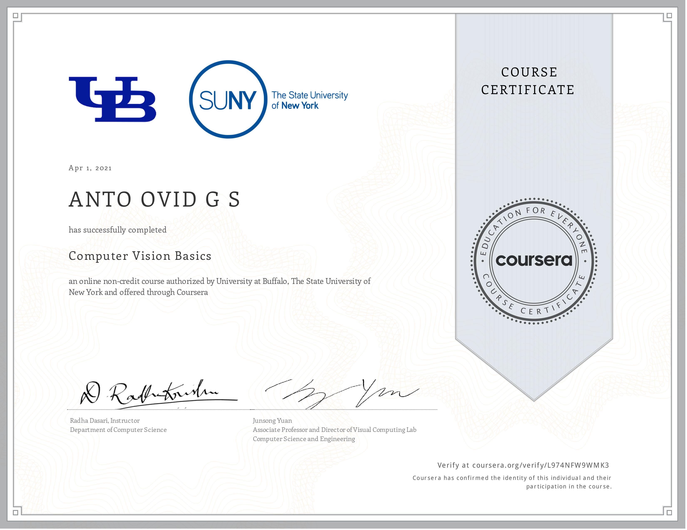

# Computer Vision Basics ~ University at Buffalo and The State University of New York

[

## 📖 Overview
- [Week 1](#week-1-computer-vision-overview)
- [Week 2](#week-2-color-light--image-formation)
- [Week 3](#week-3-low-mid--high-level-vision) 
- [Week 4](#week-4-mathematics-for-computer-vision)
- [Certificate](#-certificate)

## Week 1: Computer Vision Overview
### Programming Exercises
- [MATLAB: Accessing Image Sub-Regions](week-1/accessing_image_sub_regions.m)

## Week 2: Color, Light & Image Formation
### Programming Exercises
- [MATLAB: Color Spaces](week-2/color_spaces.m)
- [MATLAB: Color Imaging - RBG Channels](week-2/color_imaging.m)

## Week 3: Low, Mid & High Level Vision
### Programming Exercises
- [MATLAB: Image Gradient Magnitude](week-3/image_gradient_magnitude.m)

## Week 4: Mathematics for Computer Vision
### Programming Exercises
- [MATLAB: Aligning RBG Channels](week-4/aligning_rgb_channels.m)

## 🎓 [Certificate]()

